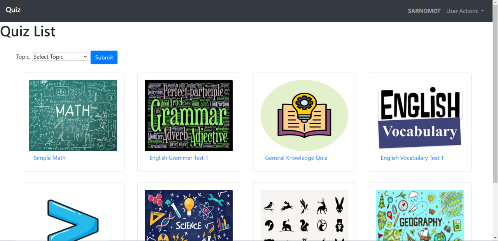

# Distinctiveness and Complexity

## Project Overview:

The Quiz App is a Django-based web application designed to provide users with an interactive platform for taking quizzes on various topics. The project adheres to the distinctiveness and complexity requirements through several key features:

1. **User Authentication:** The application includes a robust user authentication system, allowing users to register, log in, and log out securely. This ensures that each user has a personalized experience, including the ability to track their quiz results.

2. **Quiz Handling:** The core functionality revolves around taking quizzes. Users can select quizzes based on topics and difficulty levels, complete them with a timer, and receive instant feedback on their performance. The application dynamically calculates scores, determines pass/fail status, and saves results for future reference.

3. **File Structure and Organization:** The project is organized into multiple files, each serving a distinct purpose. The `views.py` file manages both user authentication and quiz functionality, providing clear separation of concerns. The `urls.py` file defines URL patterns for routing user requests to appropriate views. The `models.py` file defines database models, offering a structured representation of data. Additionally, the `templates` folder contains HTML files responsible for rendering different pages.

4. **Database Models:** The application defines custom models for users, quizzes, questions, answers, and results. This allows for a relational database structure, ensuring data integrity and efficient retrieval of information.

5. **JavaScript Interactivity:** The inclusion of JavaScript files (`index.js` and `quiz.js`) adds interactivity to the user interface. For example, on the index page, modal dialogs provide a user-friendly way to preview quiz details before starting. On the quiz page, JavaScript manages the timer, fetches quiz data asynchronously, and handles user responses without requiring page reloads.

6. **Styling with Bootstrap and Custom CSS:** The project utilizes Bootstrap for styling, providing a clean and responsive design. Additionally, a custom `style.css` file is included to add unique visual elements and animations.

## File Contents:

1. **views.py:** Manages both user authentication and quiz functionality. It includes views for login, logout, registration, quiz index, quiz details, quiz results, and more.

2. **urls.py:** Defines URL patterns for routing user requests to the appropriate views.

3. **models.py:** Defines the database structure with custom models for users, quizzes, questions, answers, and results.

4. **Templates:**
   - **layout.html:** Serves as the base template for all pages, providing a consistent structure and navigation.
   - **register.html:** Template for user registration.
   - **login.html:** Template for user login.
   - **index.html:** Template for the main quiz list page.
   - **quiz.html:** Template for the quiz page.
   - **results.html:** Template for displaying quiz results.

5. **Static Files:**
   - **index.js:** Adds interactivity to the index page, handling modal dialogs and quiz previews.
   - **quiz.js:** Manages quiz functionality, including the timer, fetching quiz data, and handling user responses.
   - **style.css:** Contains custom CSS styles and animations.

## How to Run the Application:

1. Clone the repository: `git clone <repository-url>`
2. Navigate to the project directory: `cd quiz-app`
3. Create a virtual environment: `python -m venv venv`
4. Activate the virtual environment:
   - On Windows: `venv\Scripts\activate`
   - On macOS/Linux: `source venv/bin/activate`
5. Install dependencies: `pip install -r requirements.txt`
6. Apply migrations: `python manage.py migrate`
7. Create a superuser for admin access: `python manage.py createsuperuser`
8. Run the development server: `python manage.py runserver`
9. Access the application at `http://localhost:8000/` in your web browser.

## Additional Information:

- The application uses Django, HTML, CSS, JavaScript, and Bootstrap.
- Database: SQLite (as the default database).
- The project includes necessary static files, templates, and a well-organized file structure.
- For additional Python packages, refer to `requirements.txt`.
- Ensure that the virtual environment is activated while running the application.

# Summary:

The Quiz App project combines functionality, interactivity, and a clean design to create a comprehensive quiz-taking experience. It satisfies the distinctiveness and complexity requirements by implementing user authentication, dynamic quiz handling, organized file structures, database models, and interactive JavaScript components. The README provides clear instructions on running the application and includes essential details about each file and component.
